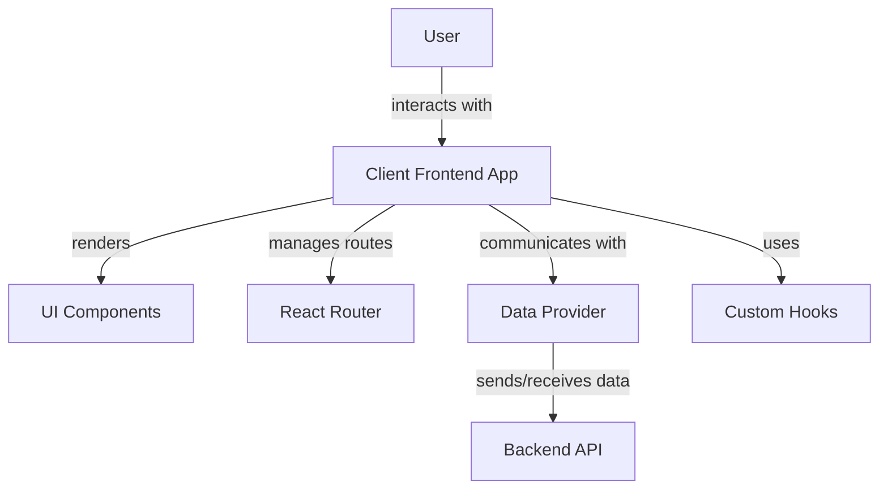
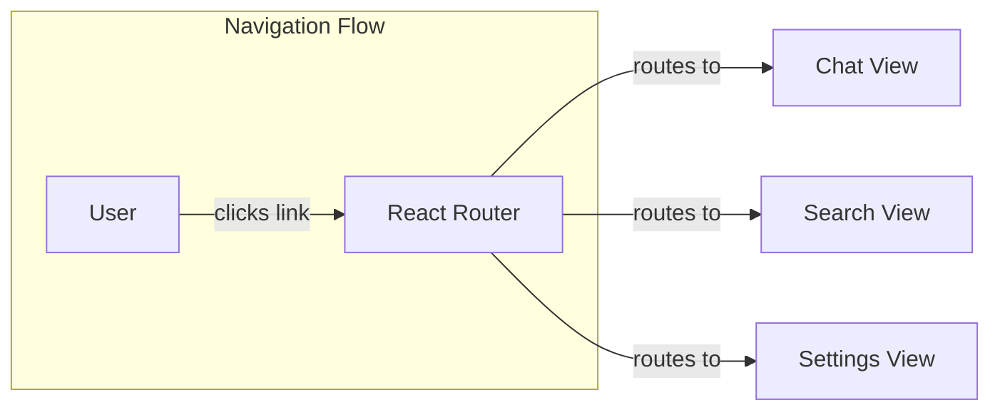
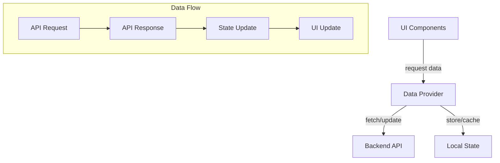
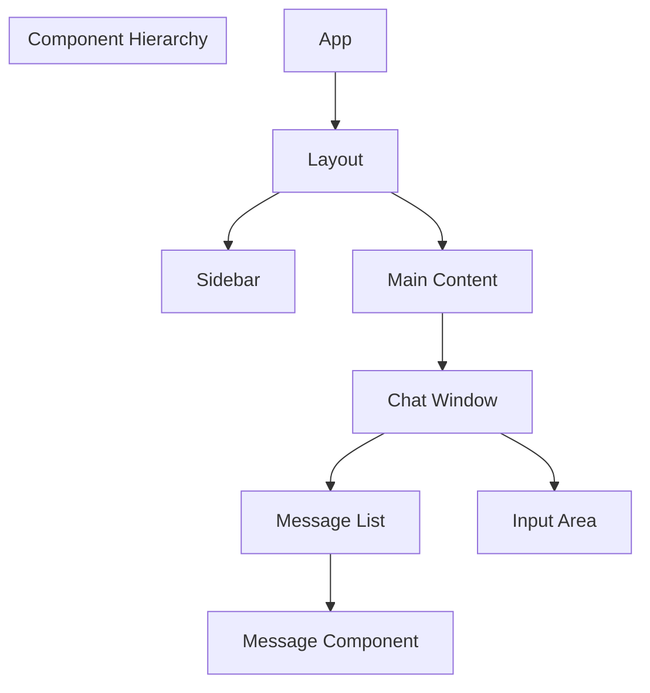
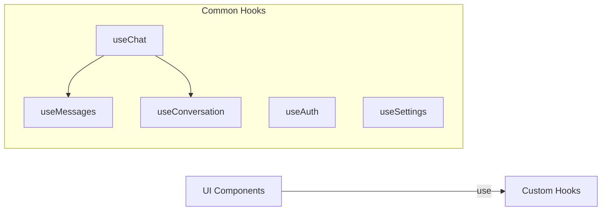
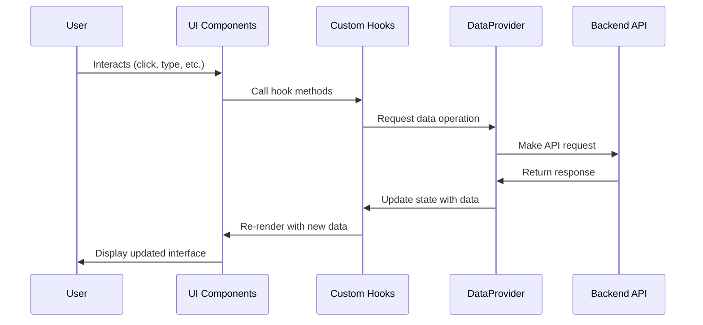

# LibreChat Client Frontend Architecture

This document provides a user-friendly overview of the LibreChat client frontend architecture, explaining how different technologies and frameworks work together to create the user interface.

## Overview

The LibreChat client frontend is built as a modern single-page application (SPA) using React. It provides the user interface that allows users to interact with the chat functionality, search for conversations, adjust settings, and more.

## Key Technologies & Frameworks

### React

React is a JavaScript library for building user interfaces. It allows developers to create reusable UI components and efficiently update the DOM when data changes.

**How it works:**
- Uses a virtual DOM to optimize rendering performance
- Follows a component-based architecture
- Manages component state and lifecycle

### React Router

React Router is a standard library for routing in React applications. It enables navigation between different views without refreshing the page.

**How it works:**
- Defines routes that map URLs to specific components
- Handles navigation history
- Provides components like `Link` for navigation without page reloads
- Supports dynamic routing with parameters

### Data Provider Layer

The Data Provider layer serves as an abstraction between the UI and the backend API. It centralizes all data fetching logic and provides a consistent interface for components to interact with.

**How it works:**
- Encapsulates API calls and data transformation logic
- Provides hooks and functions for components to fetch and update data
- Handles error states and loading indicators
- May implement caching strategies for performance optimization

### UI Components

The UI Components are reusable building blocks that make up the user interface. They ensure a consistent look and feel across the application.

**How it works:**
- Follows a hierarchical structure
- Each component has a specific responsibility
- Components can be composed together to build complex interfaces
- Styled using CSS modules, Tailwind, or other styling solutions

### Custom Hooks

Custom Hooks encapsulate reusable stateful logic that can be shared across components. They help separate business logic from UI rendering.

**How it works:**
- Follow the React Hooks pattern (use* naming convention)
- Encapsulate complex logic into reusable functions
- Manage local state, side effects, and lifecycle events
- Can compose other hooks to build more complex functionality

## Data Flow Process

## How Everything Works Together

1. **User Interaction**: The user interacts with the UI components (clicking buttons, typing messages, etc.)

2. **Component Rendering**: React components render the UI based on their current state and props

3. **Routing**: React Router determines which main view to display based on the URL

4. **State Management**: Custom hooks manage the application state and business logic

5. **Data Communication**: The Data Provider layer handles communication with the backend API

6. **UI Updates**: When data changes, React efficiently updates only the necessary parts of the UI

This architecture creates a separation of concerns that makes the codebase more maintainable, testable, and scalable. Each part of the system has a specific responsibility, and they work together to create a seamless user experience.

## Benefits of This Architecture

- **Modularity**: Components and hooks can be developed and tested in isolation
- **Reusability**: UI components and hooks can be reused across the application
- **Maintainability**: Separation of concerns makes the code easier to understand and modify
- **Performance**: React's virtual DOM and efficient rendering optimize performance
- **Developer Experience**: Clear architecture makes it easier for developers to work on the codebase
