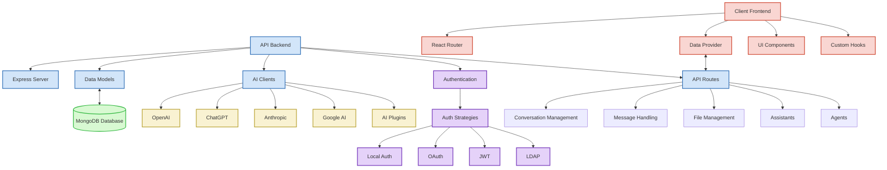

# LibreChat Architecture

This document provides an overview of the LibreChat application architecture, showing the relationships between key components.

## Architecture Diagram

## Component Relationships

### Client-Side Architecture

1. **[[Client_Frontend]]**: The main React application that serves as the user interface.
   - Uses **React Router** for navigation between different views (chat, search, settings)
   - Communicates with the backend through the **Data Provider** layer
   - Composed of reusable **UI Components** for consistent user experience
   - Utilizes custom **Hooks** for state management and business logic

2. **Data Provider**: Handles all API communication between frontend and backend
   - Manages data fetching, caching, and state synchronization
   - Uses React Query for efficient data management
   - Provides mutations for data modification operations
   - Handles authentication state and tokens

### Server-Side Architecture

1. **API Backend**: The Express.js server that handles all backend operations
   - **Express Server**: Handles HTTP requests, middleware, and routing
   - **Data Models**: Mongoose schemas for database interaction
   - **API Routes**: Endpoint definitions for various features
   - **AI Clients**: Adapters for different AI service providers
   - **Authentication**: User identity and access control

2. **Database**: MongoDB database storing all application data
   - User accounts and profiles
   - Conversations and messages
   - Files and attachments
   - Configuration settings

### AI Integration

The application connects to multiple AI providers through specialized client adapters:
- **OpenAI Client**: Connects to OpenAI API services
- **ChatGPT Client**: Specialized client for ChatGPT interactions
- **Anthropic Client**: Connects to Anthropic's Claude models
- **Google Client**: Integrates with Google's AI services
- **Plugins Client**: Supports plugin-based AI extensions

### Authentication System

Multiple authentication strategies are supported:
- **Local Authentication**: Username/password authentication
- **OAuth**: Social login providers (Google, GitHub, Discord, etc.)
- **JWT**: Token-based authentication for API access
- **LDAP**: Enterprise directory integration

### Key Subsystems

1. **Conversation Management**: Handles chat conversations
   - Creation, retrieval, updating, and deletion of conversations
   - Conversation metadata and organization

2. **Message Handling**: Manages individual messages
   - Message storage and retrieval
   - Message formatting and rendering
   - Streaming message responses

3. **File Management**: Handles file uploads and attachments
   - File storage and retrieval
   - File processing and validation
   - Integration with AI for file analysis

4. **Assistants**: Manages AI assistant configurations
   - Custom assistant definitions
   - Assistant capabilities and limitations
   - Assistant-specific settings

5. **Agents**: Handles autonomous AI agents
   - Agent definitions and capabilities
   - Agent execution and monitoring
   - Tool integration for agents
